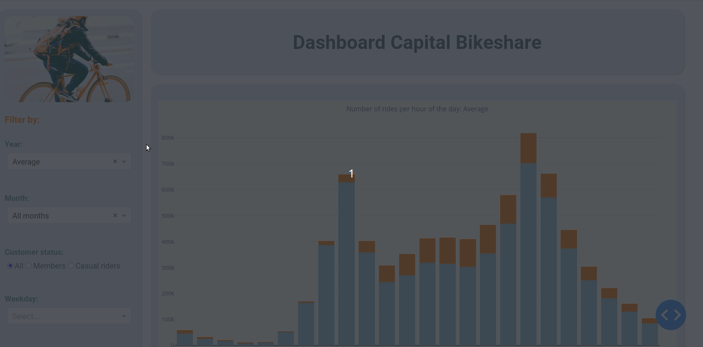

# Bikesharing-data analysis

Interactive dashboard of bikesharing data of 2018, 2019 and te first quarter of 2020.
This project has been developed in week 3 of the Spiced-bootcamp and improved afterwards.

Created using mainly pandas and dash.

## Data
- main data from capital bikeshare (https://www.capitalbikeshare.com/system-data): nearly 7.5m rides.
- locations from opendata.dc.gov
- weather data from NOAA's National Centers for environmental Information (https://www.ncdc.noaa.gov/)

## How to use:
- clone this repo
- pip install requirements.txt
- get data from capital bikeshare for 2018, 2019 and 2020, rename files: YYYYMM.csv and store in directory "data".
- get location-data from opendata.dc.gov
- get weather data for Washington D.C. from www.ncdc.noaa.gov/
- get mapbox-access-token from mapbox.com and insert into app.py line 20
- run jupyter notebook to prepare the data
- run in terminal: `python app.py`
- open browser on localhost: 8050

## To Do:
- ~~get weather data and incorporate~~
- ~~get holiday-data and incorporate~~
- ~~clean up and upload notebook~~
- ~~add data (rides and weather) for 2018 and 2020~~
- ~~add data preparation file and "how to"-section~~
- ~~tests~~
- dockerize
- host
